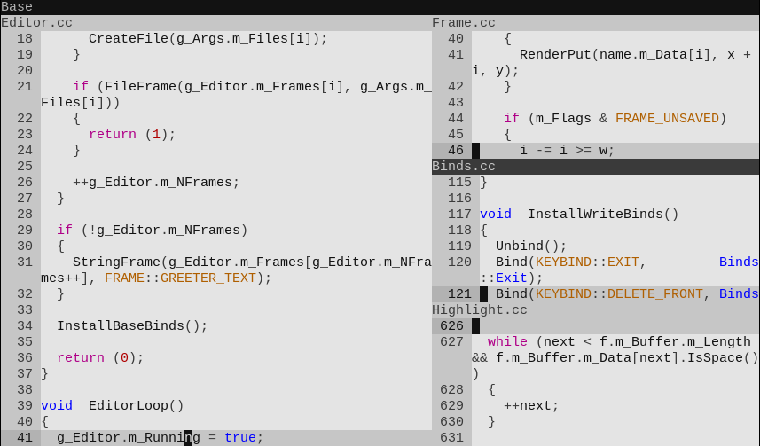

# nimpedpp



## Introduction

nimped++ is the C++ rewrite (with some featural changes / additions) of
[nimped](https://github.com/tirimid/nimped). It is a minimal terminal text
editor with modal keyboard controls, just like its parent, nimped.

## Dependencies

* Premake
* A C++ compiler for C++20
* A terminal / shell environment to run nimped++

## Management

Build using Premake; there are Debug and Release configurations.

* `./manage.sh install`: run as root to install nimped++ to the system
* `./manage.sh install-config theme`: run to install nimped++ config to user
  home; the `theme` should be replaced with the name of a file in `themes/`,
  e.g. `ridiculous-light` (without `.conf`)
* `./manage.sh uninstall`: run as root to remove nimped++ from the system
* `./manage.sh uninstall-config`: run to remove nimped++ config from user home

## Usage

Run `nimped++` in your terminal without arguments to open the nimped++ greeter.
You can also pass filenames as arguments to open them from the command line:

```
$ nimped++ file1.txt file2.txt
```

To see all command line options, run:

```
$ nimped++ -h
```

## Contributing

Feel free to contribute and fix bugs or add minor features. Feel free to also
clone nimped++ and make a derivative text editor. Note that GPLv3 licensing
restrictions apply.
