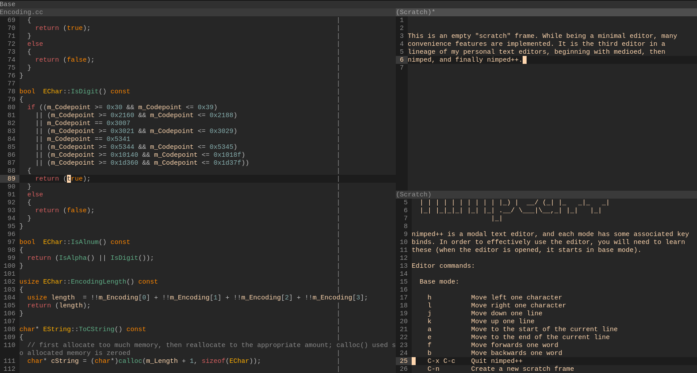
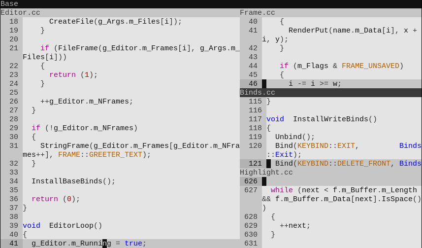

# nimpedpp





## Introduction

nimped++ is the C++ rewrite (with some featural changes / additions) of
[nimped](https://github.com/tirimid/nimped). It is a minimal terminal text
editor with modal keyboard controls, just like its parent, nimped.

## Dependencies

* Premake (for build)
* GNU Make (for build)
* A C++ compiler for C++20 (for build)
* A terminal / shell environment to run nimped++
* Linux environment (nimped++ has not been tested on other platforms)

## Management

Run `./manage` to see the help information. This script automates project build,
installation, and uninstallation.

## Usage

Run `nimped++` in your terminal without arguments to open the nimped++ greeter.
You can also pass filenames as arguments to open them from the command line:

```
$ nimped++ file1.txt file2.txt
```

To see all command line options, run:

```
$ nimped++ -h
```

## Contributing

Feel free to contribute and fix bugs or add minor features. Feel free to also
clone nimped++ and make a derivative text editor. Note that GPLv3 licensing
restrictions apply.
